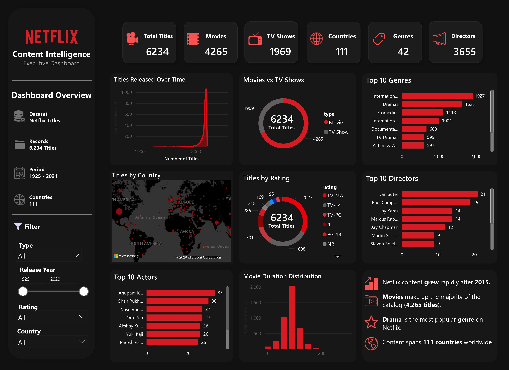

<div align="center">

# 🎬 Netflix Content Intelligence Platform

### Business Intelligence & Decision Support System

An end-to-end Data Analytics project that transforms raw Netflix metadata into actionable business insights using **Excel, SQL, Python, MySQL, and Power BI**.

---


</div>

---

# 📌 Project Overview

The **Netflix Content Intelligence Platform** is an end-to-end Business Intelligence project developed to analyze Netflix's publicly available content catalog.

The project demonstrates the complete data analytics lifecycle—from raw data profiling and cleaning to database normalization, SQL analysis, Python automation, and interactive Power BI dashboard development.

Unlike many dashboard-only projects, this project focuses on **business decision support** by combining multiple analytical technologies into a single workflow.

---

# 🎯 Business Problem

Netflix offers thousands of Movies and TV Shows across different countries, genres, and audience categories.

Managing such a large content library requires data-driven insights rather than assumptions.

This project aims to answer strategic business questions such as:

- Which genres dominate Netflix's catalog?
- Which countries contribute the most content?
- How has Netflix's content library grown over time?
- Which audience ratings are most common?
- Which directors and actors appear most frequently?
- What patterns can support future content strategy?

---

# 🚀 Project Objectives

- Perform data profiling and quality assessment.
- Clean and preprocess raw Netflix metadata.
- Normalize multi-valued attributes into relational database tables.
- Automate preprocessing using Python.
- Perform SQL-based business analysis.
- Develop an interactive Power BI dashboard.
- Generate business insights to support decision-making.

---

# 🛠 Technology Stack

| Technology | Purpose |
|------------|---------|
| Microsoft Excel | Data Profiling |
| MySQL | Database Management |
| SQL | Data Cleaning & Business Queries |
| Python | Automation & Normalization |
| Pandas | Data Manipulation |
| SQLAlchemy | Database Connectivity |
| Matplotlib | Exploratory Visualization |
| Microsoft Power BI | Dashboard Development |
| GitHub | Documentation & Version Control |

---

# 📂 Project Workflow

```text
Raw Dataset
      │
      ▼
Excel Data Profiling
      │
      ▼
SQL Data Cleaning
      │
      ▼
Python Data Normalization
      │
      ▼
MySQL Relational Database
      │
      ▼
Power BI Dashboard
      │
      ▼
Business Insights
```

---

# 📊 Dashboard Showcase

## Executive Dashboard


---

## Dashboard Features

- Executive KPI Cards
- Movies vs TV Shows Analysis
- Release Year Trends
- Genre Analysis
- Country-wise Content Distribution
- Audience Rating Analysis
- Top Directors
- Top Actors
- Movie Duration Distribution
- Interactive Slicers
- Dynamic Cross Filtering
- Business Insights Panel

---

# 📈 Key KPIs

| KPI | Value |
|------|------:|
| Total Titles | 6,234 |
| Movies | 4,265 |
| TV Shows | 1,969 |
| Countries | 111 |
| Genres | 42 |
| Directors | 3,655 |

---

# 💡 Key Business Insights

- Movies represent the majority of Netflix's content library.
- Netflix experienced rapid content growth after 2015.
- International Movies and Dramas dominate the catalog.
- TV-MA is the most common audience rating.
- Netflix content spans 111 countries.
- Most movies have durations between 90–120 minutes.
- Interactive filtering enables dynamic business exploration.

---

# 🗄 Database Design

The dataset was normalized into relational tables to reduce redundancy and improve analytical flexibility.

### Master Table

- clean_netflix_titles

### Dimension Tables

- actors
- directors
- countries
- genres

### Bridge Tables

- title_actor
- title_director
- title_country
- title_genre

---

# 🐍 Python Workflow

Python was used for:

- Importing data into MySQL
- Data normalization
- Creating relational tables
- Exploratory data analysis
- Visualization generation

The normalization workflow was reused for:

- Actors
- Directors
- Countries
- Genres

---

# 🗃 SQL Analysis

SQL was used to answer multiple business questions including:

- Movies vs TV Shows
- Content Ratings
- Release Year Trends
- Top Directors
- Top Actors
- Genre Distribution
- Country Analysis
- Movie Duration Analysis

---

# 📁 Repository Structure

```text
Netflix_Content_Intelligence_Platform
│
├── README.md
│
├── 01_Business
│
├── 02_Dataset
│   ├── Raw
│   └── Working
│
├── 03_SQL
│
├── 04_Python
│
├── 05_PowerBI
│
├── 06_Report
│
├── 07_GitHub
│
├── 08_Images
│
└── LICENSE
```

---

# ▶️ How to Run

### 1. Clone Repository

```bash
git clone https://github.com/d2kshh/Netflix_Content_Intelligence_Platform.git
```

### 2. Create MySQL Database

```sql
CREATE DATABASE netflix_analytics;
```

### 3. Import Dataset

Run:

- `01_Import_To_MySQL.py`

### 4. Execute SQL Scripts

Run SQL files in the following order:

1. Database Creation
2. Data Cleaning
3. Business Analysis Queries

### 5. Execute Python Scripts

```text
01_Import_To_MySQL.py

02_Data_Normalization.py

03_Exploratory_Data_Analysis.py
```

### 6. Open Power BI

Open

```
Netflix_Content_Intelligence.pbix
```

Refresh the data source.

---

# 📚 Dataset

**Netflix Titles Dataset**

Source:

https://comp-think.github.io/laboratory/site/chapter/06/

---

# 📌 Future Improvements

- Machine Learning Predictions
- Recommendation System
- Natural Language Processing
- Live Database Connectivity
- Cloud Deployment
- Real-time Analytics

---

# 👨‍💻 Author

**Daksh Patel**

Bachelor of Engineering (Information Technology)

Government Engineering College, Modasa

---

# ⭐ If you found this project useful

Please consider giving this repository a **Star ⭐**.

It helps others discover the project and supports my learning journey.

---

<div align="center">

### Thank you for visiting this project ❤️

</div>
